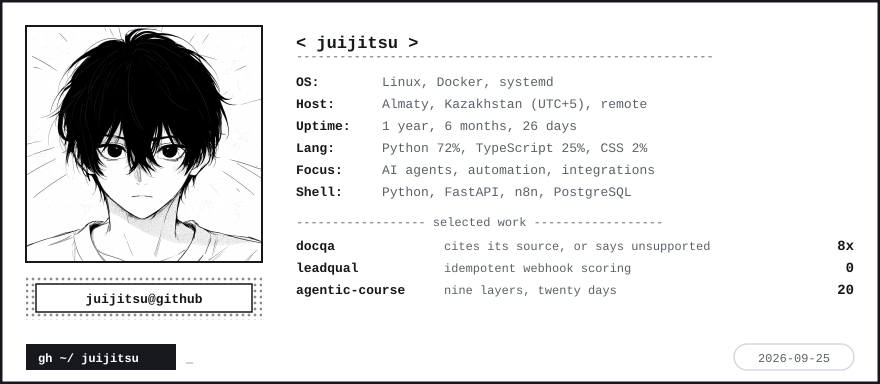

<h1>Hi 👋, I'm juijitsu</h1>

<h3>AI agents and automation that survive contact with real data.</h3>

<picture>
  <source media="(prefers-color-scheme: dark)" srcset="https://readme-typing-svg.demolab.com?font=Fira+Code&weight=500&size=20&duration=3400&pause=900&color=F0F0F0&center=true&vCenter=true&width=620&height=40&lines=AI%20agents%20that%20survive%20production%3BFail%20loudly%2C%20never%20corrupt%20silently%3BRetries%2C%20caching%2C%20idempotency" />
  
</picture>

 

## 🚀 Now Building

<!--START_SECTION:now-building-->
- **[agentic-course](https://github.com/juijitsu/agentic-course)** &mdash; A twenty-day course on agentic systems: nine architectural layers, a design method, and... `2026-09-02`
- **[leadqual](https://github.com/juijitsu/leadqual)** &mdash; Webhook lead qualification agent: n8n posts a lead, Claude scores it against a rubric,... `2026-07-20`
- **[docqa](https://github.com/juijitsu/docqa)** &mdash; Grounded document Q&A: the model must cite the source passage it used, or the answer is... `2026-07-20`

Refreshed automatically on 2026-09-02 (UTC).
<!--END_SECTION:now-building-->

<picture>
  <source media="(prefers-color-scheme: dark)" srcset="assets/neofetch-dark.svg" />
  
</picture>

## 🛠 What I can build for you

| | |
|---|---|
| **Webhook and pipeline automation** | Inbound events turned into reliable work. Signed, idempotent, retry-safe, so a retry never double-bills a model call or writes the same record twice. |
| **Retrieval and document Q&A** | Answers that cite the passage they came from, so a wrong answer surfaces as *unsupported* instead of confident and wrong. |
| **LLM agents with guardrails** | Scoring, extraction and classification where the model supplies evidence and code computes the result, never the other way around. |
| **Backend services** | FastAPI, PostgreSQL, Docker, Linux. The unglamorous half that decides whether the clever half is still running a month from now. |

## 🧰 Stack

**Languages and backend**

**AI and agents**

**Data and infrastructure**

## 📊 Snapshot

<picture>
  <source media="(prefers-color-scheme: dark)" srcset="assets/languages-dark.svg" />
  
</picture>

<picture>
  <source media="(prefers-color-scheme: dark)" srcset="assets/activity-dark.svg" />
  
</picture>

## 🎐 Quote of the day

<!--START_SECTION:quote-->
<table><tr><td>

> *It's not just allies who support each other. From your enemies, you learn so much and gain so much. Until the day you meet again... Just knowing they exist helps you to withstand the loneliness. Those who compete, even if they're enemies, help each other out.*
>
> **Hiroko Seto** &mdash; Your Lie in April

</td></tr></table>
<!--END_SECTION:quote-->

## 🍵 How I work

I start from the process you actually run, not from the tool. First call: I map
your steps and tell you which parts are worth automating, which aren't, and where
it will break. Then I ship the smallest version that works, prove it on your real
data, and expand.

 

📫 **policedepartments154@gmail.com** &nbsp;·&nbsp; Almaty, Kazakhstan (UTC+5), remote &nbsp;·&nbsp; English (fluent), Russian (native)

 

Language and activity cards are generated by <a href="scripts/gen_stats.py">a script in this repo</a>
and committed daily — no third-party uptime involved. 
Built with <a href="https://shields.io/">shields.io</a>,
<a href="https://simpleicons.org/">Simple Icons</a>,
<a href="https://github.com/kyechan99/capsule-render">capsule-render</a> and
<a href="https://github.com/DenverCoder1/readme-typing-svg">readme-typing-svg</a>.
Project cards are drawn by <a href="scripts/gen_cards.py">gen_cards.py</a>.

