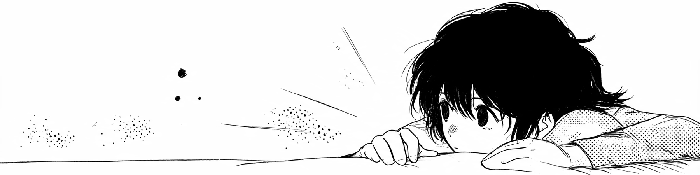
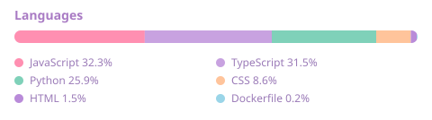
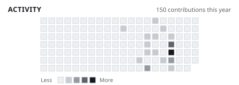

<!-- БАННЕР. Когда пришлёте арт (1600x400, имя "Amir K." вписано внутрь):
     положите файл в assets/banner.png и замените строку ниже на
               -->

 

 

## 🌸 Hi, I'm Amir

**AI agents and automation that survive contact with real data.**

I build the parts most automation skips: retries, caching, idempotency and
resume-on-failure — so a bad API response at 3am degrades loudly instead of
corrupting a pipeline silently.

## 🚀 Now Building

<!--START_SECTION:now-building-->
- **[bc-rent-demo](https://github.com/amirk-dev/bc-rent-demo)** &mdash; Business-centre lease management: an interactive demo of the tenant, contract and billi... `2026-09-02`
- **[agentic-course](https://github.com/amirk-dev/agentic-course)** &mdash; A twenty-day course on agentic systems: nine architectural layers, a design method, and... `2026-09-02`
- **[leadqual](https://github.com/amirk-dev/leadqual)** &mdash; Webhook lead qualification agent: n8n posts a lead, Claude scores it against a rubric,... `2026-07-20`

Refreshed automatically on 2026-09-02 (UTC).
<!--END_SECTION:now-building-->

## 💗 What I can build for you

| | |
|---|---|
| **Webhook and pipeline automation** | Inbound events turned into reliable work. Signed, idempotent, retry-safe, so a retry never double-bills a model call or writes the same record twice. |
| **Retrieval and document Q&A** | Answers that cite the passage they came from, so a wrong answer surfaces as *unsupported* instead of confident and wrong. |
| **LLM agents with guardrails** | Scoring, extraction and classification where the model supplies evidence and code computes the result, never the other way around. |
| **Backend services** | FastAPI, PostgreSQL, Docker, Linux. The unglamorous half that decides whether the clever half is still running a month from now. |

## 🧰 Stack

**Languages and backend**

**AI and agents**

   

**Data and infrastructure**

## 📦 Selected projects

Ask questions against your own documents and get answers that cite the exact
passage. The anti-hallucination guarantee is structural, not a prompt: the model
must return the IDs of the passages it used, and any ID that wasn't in the
retrieved context is stripped and the answer flagged unsupported. A
content-addressed embedding cache makes re-indexing an unchanged corpus a 100%
cache hit and ~8x faster on a 4,669-chunk index.

n8n posts an inbound lead, Claude scores it against a rubric, hot leads land in
Slack with a reason and a next step. The model never picks the score: five criteria
with fixed point ceilings, evidence quoted per criterion, total computed in code
and clamped. The webhook is HMAC-signed with a replay window, and `external_id` is
an idempotency key — so n8n retries never double-bill a model call.

A twenty-day course on agentic systems, built as a static Next.js app —
[read it here](https://amirk-dev.github.io/agentic-course/). The argument is that
the agent loop is one layer out of nine, and the other eight decide whether the
thing holds up: harness, rules, skills, MCP and memory all treated as one scale of
*when does this enter the context*. **Course content is in Russian.**

## 📊 Snapshot

<picture>
  <source media="(prefers-color-scheme: dark)" srcset="assets/languages-dark.svg" />
  
</picture>

<picture>
  <source media="(prefers-color-scheme: dark)" srcset="assets/activity-dark.svg" />
  
</picture>

## 🎐 Quote of the day

<!--START_SECTION:quote-->
<table><tr><td>

> *Games are not boring. Games purify our souls and leave room for new development that challenges the mind! They are the products of human wisdom!*
>
> **Seto Kaiba** &mdash; Yu-Gi-Oh!

</td></tr></table>
<!--END_SECTION:quote-->

## 🍵 How I work

I start from the process you actually run, not from the tool. First call: I map
your steps and tell you which parts are worth automating, which aren't, and where
it will break. Then I ship the smallest version that works, prove it on your real
data, and expand.

 

📫 **policedepartments154@gmail.com** &nbsp;·&nbsp; Almaty, Kazakhstan (UTC+5), remote &nbsp;·&nbsp; English (fluent), Russian (native)

 

Language and activity cards are generated by <a href="scripts/gen_stats.py">a script in this repo</a> and committed daily — no third-party uptime involved.

